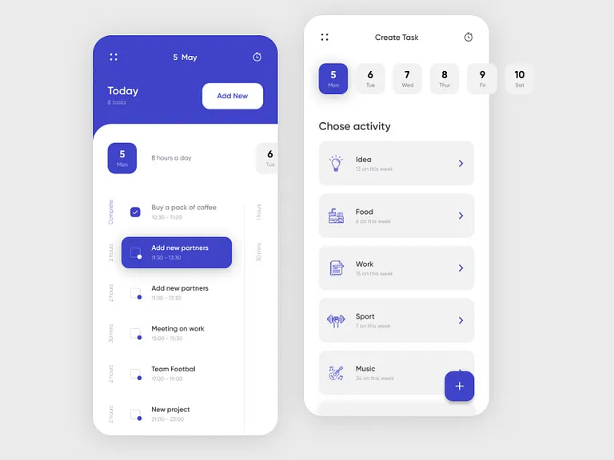

## Description

taskflow est une apllication moderne de management des tâches. Elle est construite en s'inspirant de 
framework populaire(lit-element,react). Elle s'appuie sur des composants réutilisables pour le montage de 
to-do-list coder en javascript pur sans aucune dépendance externe.

## Tesign



## Architecture du projet


l'application s'appuie sur des composants réutilisables.

chaque composant encapsule:

- HTML
- CSS
- la logique JavaScript

la comunication entre les composants est assuré par les customEvents.

## Arborescence fichiers

```text
my-toDolistApp
│   .gitignore
│   README.md
│
├───design
│       todolistnow.webp
│
└───src
    │   index.html
    │   style.css
    │
    ├───components
    │   ├───add-button
    │   │       .gitkeep
    │   │       add-button.js
    │   │
    │   ├───calendar-strip
    │   │       .gitkeep
    │   │       calendar-strip.js
    │   │
    │   ├───task-item
    │   │       .gitkeep
    │   │       style.css
    │   │       style.js
    │   │       task-item.js
    │   │
    │   └───task-list
    │           task-list.js
    │
    ├───core
    │       base-element.js
    │       utils.js
    │
    ├───css
    │       .gitkeep
    │       essai.css
    │
    └───js
            .gitkeep
            app.js

```

## Roadmap

- [x] Task creation
- [ ] Task deletion
- [ ] Local Storage
- [ ] Categories

## Auteur

orimiyaSaki

GitHub: https://github.com/Orimiya